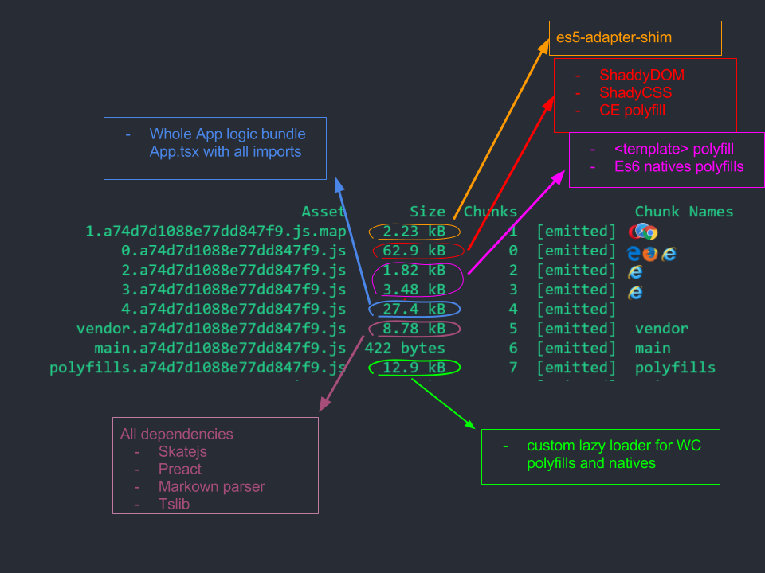

# Skate-starter

> Webpack 2, Typescript 2, SkateJs for super powered reactive web-components

## Start development

`yarn start`

## Build project

`yarn build`

## Test

> @TODO
`yarn test`

## Format and fix lint errors

`yarn ts:style:fix`

## Commit ( via commitizen )

`yarn commit`

## Release

`yarn release`

## bundle/polyfill sizes

Of course not all browsers support WebComponents spec, so polyfills are needed.

Here a little showcase what will be donwloaded by what browser at what size

> Note sizes are only for minified code not g-zipper

